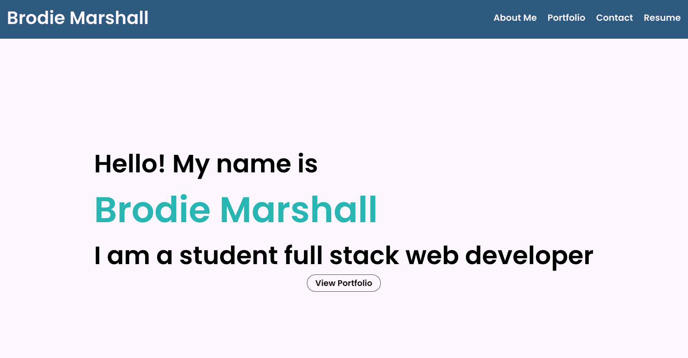

# Coding Bootcamp Week 20 Challenge - React Portfolio

## Description

This weeks challenge focused on creating a new and updated portfolio with React. This was my first time building an application with React and i enjoyed using it. The portfolio features 6 of my projects I've completed during my time at the coding bootcamp, along with an about me, contact and resume section.

## Built With

- React
- JavaScript
- Git Hub Pages (for deployment)

## Usage

To access the website, click the link below.

https://brodie02.github.io/react-portfolio-good/

## Credits

Made by [Brodie Marshall](https://github.com/brodie02)

---
